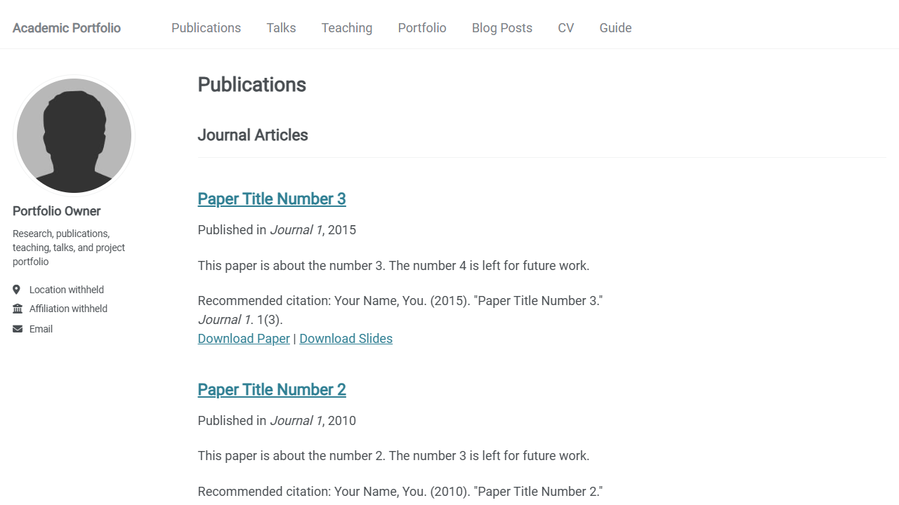
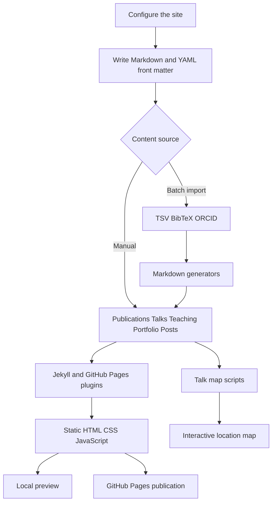
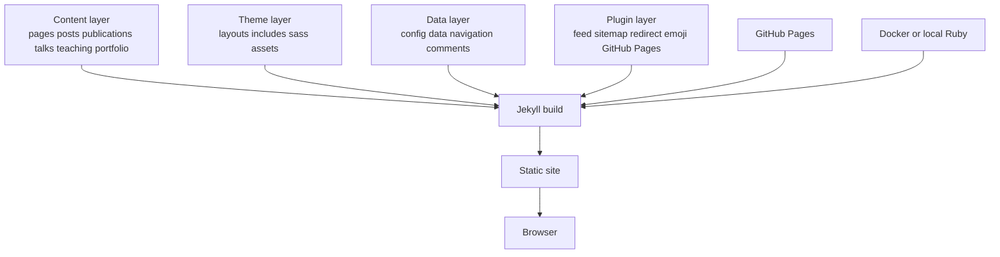

<div align="center">
  

  <sub>Figure 1.1 — Academic website template for publications, talks, teaching, projects, posts, and CVs</sub>
</div>

<h1 align="center">Academic Portfolio</h1>

<p align="center">
  A data-driven Jekyll academic website based on Academic Pages<br />
  Content stays separate from the theme and builds on GitHub Pages or in a local container
</p>

<p align="center">
  <a href="./README.md">简体中文</a> ·
  <a href="./README.en.md"><strong>English</strong></a> ·
  <a href="./_pages/markdown.md">Writing guide</a> ·
  <a href="./CONTRIBUTING.md">Contributing</a> ·
  <a href="./LICENSE">License</a>
</p>

<p align="center">
  
  
  
  
  
  <br />
  <sub>Stack claims are grounded in the dependency manifests and container baseline [1]–[3]</sub>
</p>

> [!IMPORTANT]
> The current branch replaces the original name, institution, precise location, account identifier, deployed site address, and personal portrait with reusable placeholders. Add personal details locally only after deciding what should remain public

## 1 Project overview

Academic Portfolio is a customized copy of Academic Pages. It stores publications, talks, teaching, projects, posts, and CV material as Markdown, YAML, HTML, and downloadable files, then uses Jekyll to generate a static website [1][4]

The repository includes the theme, sample content, page templates, sample papers and slides, batch content generators, a talk-map workflow, and a Docker preview environment. Sample titles and the fictional CV demonstrate the data model and are not verified personal achievements

<div align="center">

Table 1.1 — Project positioning

| Dimension | Current implementation | Fit |
| --- | --- | --- |
| Website type | Academic and technical portfolio | Researchers, students, engineers, and instructors |
| Content model | Markdown with YAML front matter | Content remains portable across theme changes |
| Build options | Jekyll, GitHub Pages, and Docker | Hosted builds and local previews |
| Content scope | Publications, talks, teaching, portfolio, posts, CV, and map | Covers common academic website needs |
| Current data | Upstream samples with privacy-safe placeholders | Replace and verify before publishing |
| License | MIT [5] | Reuse, modification, and redistribution under the license |

</div>

## 2 Interface preview

The following screenshots come from a real local Jekyll build of the privacy-sanitized source. They contain only template samples and placeholder profile data

<div align="center">
  

Figure 2.1 — Home page with navigation, a generic portrait, placeholder author data, and the Academic Pages guide
</div>

<details>
<summary><strong>Open the publications page</strong></summary>

<br />

<div align="center">
  

Figure 2.2 — Publication entries generated from structured front matter
</div>
</details>

<details>
<summary><strong>Open the upstream reference image</strong></summary>

<br />

<div align="center">
  

Figure 2.3 — The Academic Pages reference screenshot retained from the original repository
</div>
</details>

## 3 Core capabilities

<div align="center">

Table 3.1 — Site capabilities and sources

| Capability | What it presents | Primary source |
| --- | --- | --- |
| Profile home page | Bio, portrait, affiliation, location, and contact links | `_config.yml`, `_pages/about.md` |
| Publication archive | Categories, titles, abstracts, venues, citations, and files | `_publications/` |
| Talk archive | Dates, locations, events, abstracts, slides, and map data | `_talks/` |
| Teaching archive | Courses, terms, roles, and descriptions | `_teaching/` |
| Portfolio | Project narratives, images, links, and custom HTML | `_portfolio/` |
| Blog | Posts organized by year, category, and tag | `_posts/` |
| Generated CV | Publications, talks, and teaching collected into one page | `_pages/cv.md` |
| Talk map | Interactive map generated from talk locations | `talkmap.py`, `talkmap.ipynb` |
| Batch generation | Markdown generation from TSV, BibTeX, and ORCID | `markdown_generator/` |
| SEO and feeds | Sitemap, feed, redirects, and sharing metadata | Jekyll plugins and theme includes [1] |
| Comments and analytics | Optional Disqus, Discourse, Facebook, Staticman, and analytics | `_config.yml`, `_includes/` |
| Container preview | Ruby 3.2 build exposed on port `4000` | `Dockerfile` [3] |

</div>

## 4 Content pipeline

<div align="center">



Figure 4.1 — Relationship between source content, generators, Jekyll, and publication targets

</div>

Markdown carries readable content, while YAML front matter supplies dates, categories, links, and layouts. The same talk record can populate the talk archive, an individual page, the generated CV, and the location map [4]

## 5 System structure

<div align="center">



Figure 5.1 — Content, theme, configuration, plugins, and build environments

</div>

<div align="center">

Table 5.1 — Main components

| Component | Responsibility | Maintenance boundary |
| --- | --- | --- |
| Jekyll | Parse content, layouts, and collections into static files | Ruby dependencies are declared in `Gemfile` |
| Minimal Mistakes derivative | Navigation, responsive layout, archives, author profile, and page components | Styles live in `_sass/`; templates live in `_layouts/` and `_includes/` |
| GitHub Pages plugin set | Hosting-compatible Jekyll, feed, sitemap, and metadata | Versions follow the `github-pages` meta-package [1] |
| JavaScript build | Combine and minify jQuery and UI plugins | Scripts are declared in `package.json` [2] |
| Content generators | Convert tables, bibliography data, and ORCID records | Python and Jupyter files live in `markdown_generator/` |
| Talk map | Geocode places and produce a Leaflet map | Requires external data and location review |

</div>

## 6 Quick start

### 6.1 Create a site from the template

1. Register a GitHub account and confirm its email address

2. Open the upstream Academic Pages repository, select `Use this template`, and create a repository [6]

3. Give the repository the personal-site name required by GitHub Pages. Public documentation should use `account-name` instead of a real account identifier

4. Update `_config.yml` and `_data/navigation.yml`, then add verified material to the content directories [7]

5. Put papers, slides, archives, or other public downloads in `files/` and link to them with relative paths

6. Check the Pages source and build status in repository settings. The README does not need to expose the deployed address

7. Optionally run the Python or Jupyter tools in `markdown_generator/` to create publication and talk entries in bulk

### 6.2 Preview on Linux or WSL

```bash
# Install Ruby headers, Bundler, Node.js, and native-extension build tools
sudo apt install ruby-dev ruby-bundler nodejs build-essential gcc make # Install the Jekyll build prerequisites

# Install the Ruby dependencies declared in Gemfile
bundle install # Resolve and install Jekyll and its plugins

# Start a live-reloading preview on the local loopback interface
bundle exec jekyll serve -l -H localhost # Serve on localhost port 4000 by default
```

If an old lock file conflicts with the current Ruby environment, back it up and remove it before running `bundle install` again. This repository does not commit a lock file, so a clean install may resolve different transitive versions over time

### 6.3 Preview on macOS

```bash
# Install Ruby and Node.js through Homebrew
brew install ruby # Install an independent Ruby runtime
brew install node # Install the JavaScript build tools

# Install Bundler and resolve project dependencies
gem install bundler # Install the Ruby dependency manager
bundle install # Install Jekyll and its plugins

# Start the local live-reloading preview
bundle exec jekyll serve -l -H localhost # Serve on localhost port 4000 by default
```

## 7 Docker workflow

The Dockerfile starts from Ruby `3.2`, installs `build-essential` and Node.js, installs Bundler `2.3.26`, resolves the Gemfile, and serves Jekyll on container port `4000` [3]

### 7.1 Linux and macOS

```bash
# Build the local Jekyll image
docker build -t academic-portfolio . # Use the repository Dockerfile

# Mount the working tree and expose the preview port
docker run -p 4000:4000 --rm -v "$(pwd):/usr/src/app" academic-portfolio # Remove the container when it exits
```

### 7.2 Windows PowerShell

```powershell
# Build the local Jekyll image
docker build -t academic-portfolio . # Use the repository Dockerfile

# Map the PowerShell current directory into the container
docker run -p 4000:4000 --rm -v "${PWD}:/usr/src/app" academic-portfolio # Mount the working tree
```

### 7.3 Windows Command Prompt

```bat
REM Build the local Jekyll image
docker build -t academic-portfolio . REM Use the repository Dockerfile

REM Map a verified absolute path into the container
docker run -p 4000:4000 --rm -v C:\path\to\site:/usr/src/app academic-portfolio REM Replace the example path with the local project directory
```

If volume mapping fails, allow the project drive in Docker Desktop resource and file-sharing settings. Do not paste real usernames, home directories, or server paths into public issues, screenshots, or documentation

## 8 Authoring and managing content

<div align="center">

Table 8.1 — Content directories and front matter

| Path | One file represents | Common fields |
| --- | --- | --- |
| `_pages/` | A fixed page or archive entry point | `title`, `permalink`, `layout` |
| `_posts/` | A blog post | Date, title, categories, tags |
| `_publications/` | A paper or publication | `category`, `venue`, `paperurl`, `citation` |
| `_talks/` | A talk or tutorial | Date, place, event, slide link |
| `_teaching/` | A course or teaching record | Course, term, role, description |
| `_portfolio/` | A project or work sample | Title, summary, image, external link |
| `files/` | A downloadable attachment | Papers, slides, and other public files |
| `_data/navigation.yml` | The top navigation | Link title and relative URL |

</div>

Contributors can use a local Git client or edit files through GitHub's pencil button. GitHub also supports file deletion, creation, and uploads from the directory view. Before deleting any file, check its attachment links and internal references

`_pages/markdown.md` demonstrates headings, tables, code, highlighting, notices, collapsible content, and other supported theme syntax [8]

## 9 Batch generation and talk map

`markdown_generator/` preserves Python scripts, Jupyter notebooks, TSV samples, BibTeX conversion, and ORCID import. A practical workflow keeps publications and talks in a table, generates separate Markdown files, reviews each result, and commits only verified records

<div align="center">

Table 9.1 — Automation tools

| Tool | Input | Output or purpose |
| --- | --- | --- |
| `publications.py` / `.ipynb` | `publications.tsv` | Generate publication entries |
| `talks.py` / `.ipynb` | `talks.tsv` | Generate talk entries |
| `pubsFromBib.py` / `.ipynb` | BibTeX | Convert bibliography records |
| `OrcidToBib.ipynb` | Public ORCID records | Produce intermediate BibTeX |
| `talkmap.py` / `.ipynb` | Location fields in `_talks/` | Generate the talk-location map |

</div>

Geocoding sends place names to an external service. Remove home addresses, precise office locations, and unnecessary personal location data before running it

## 10 Configuration and privacy

`_config.yml` controls the locale, title, description, URL, author profile, academic and social accounts, comments, analytics, feed, collections, default layouts, and plugins [4]

<div align="center">

Table 10.1 — Privacy review before publication

| Data | Current state | Publication guidance |
| --- | --- | --- |
| Name and pronouns | `Portfolio Owner` and an empty value | Add only the form intended for long-term public use |
| Institution | `Affiliation withheld` | A public institution name is enough; omit internal identifiers |
| Location | `Location withheld` | City-level data is usually sufficient; omit postal and street data |
| Email | Reserved `example.invalid` domain | Use a dedicated public contact address |
| GitHub and social accounts | Empty | Add accounts one at a time and omit internal user IDs |
| Site address | Empty | Set it in deployment configuration when a canonical URL is required |
| Portrait | Generic silhouette | Review EXIF and background details before using a real photo |
| Analytics and comments | Disabled | Add a privacy notice and cookie policy before enabling |

</div>

Before every public commit, scan access tokens, API keys, private keys, passwords, deployed addresses, account IDs, local paths, and attachment metadata. Images and PDFs need separate metadata checks because ordinary text search does not cover their binary contents

## 11 Repository map

<div align="center">

Table 11.1 — Directory guide

| Path | Contents |
| --- | --- |
| `_config.yml` | Site settings, author profile, collections, plugins, and build options |
| `_data/` | Navigation, interface text, authors, and sample comment data |
| `_pages/` | Home, archives, CV, map, guide, and legal pages |
| `_posts/` | Sample blog posts |
| `_publications/` | Sample publications and citations |
| `_talks/` | Sample talks and tutorials |
| `_teaching/` | Sample teaching records |
| `_portfolio/` | Markdown and HTML portfolio samples |
| `_layouts/`, `_includes/` | Page skeletons and reusable components |
| `_sass/`, `assets/` | Styles, icon fonts, scripts, and README media |
| `images/`, `files/` | Page imagery, sample papers, and slides |
| `markdown_generator/` | Batch content generators |
| `talkmap/` | Leaflet runtime assets |
| `Dockerfile`, `Gemfile` | Container and Ruby build environments |

</div>

## 12 Validation results

Validation ran on Ubuntu with Ruby `3.2.3`, Bundler `2.3.26`, and Node.js `22.15.0`. Because the WSL account could not install system Ruby headers, the test environment extracted the matching Ubuntu development package into a temporary directory without changing the repository build definition

```bash
# Install the Ruby dependencies declared by the repository
bundle install # Resolve Gemfile and install Jekyll with its plugins

# Generate the complete static site with error traces enabled
bundle exec jekyll build --trace # Write the generated site to the default _site directory
```

<div align="center">

Table 12.1 — End-to-end validation

| Check | Result | Detail |
| --- | --- | --- |
| Complete Jekyll build | Pass | Static generation completed without build errors |
| Home-page browser check | Pass | Placeholder profile, navigation, and content render correctly |
| Publications browser check | Pass | Categories, records, citations, and download links render |
| Browser console | Pass | Zero errors with the local URL override |
| README media | Pass | Hero and three preview images are repository-local |
| Current-tree identity scan | Pass | Direct identity strings remain only in Git history, not the current tree |
| Historical Pages build | Pass | `master` has a successful deployment record; the deployed address is omitted here |
| Native Windows checkout | Fail | A tracked directory name contains trailing spaces and Git for Windows rejects it |

</div>

## 13 Known limitations

- A workflow file is stored under a directory whose name contains trailing spaces. GitHub does not recognize it as `.github/workflows/`, and Git for Windows cannot check out the path
- The inactive workflow still uses `actions/checkout@v2`, `actions/setup-python@v2`, and Python `3.9`. Review its self-commit behavior and upgrade it before moving it into the active workflow directory
- The repository does not commit `Gemfile.lock`, so clean environments re-resolve transitive dependencies
- The `github-pages` meta-package currently resolves Jekyll `3.10`; installing a newer standalone Jekyll can differ from the hosted runtime
- Publications, talks, teaching, CV records, and posts are template examples that must be replaced or removed
- The talk map depends on external geocoding and Leaflet resources, and geocoded places can be inaccurate
- Comments, analytics, and social integrations require additional accounts, privacy documentation, and network validation
- The theme descends from an older Minimal Mistakes branch, so direct upstream synchronization can create extensive conflicts
- The personal portrait has been removed from the current tree, but Git history still contains its old object. If that history is itself sensitive, evaluate a separate history rewrite and its collaboration impact

## 14 Upstream maintenance and synchronization

Template bugs and feature requests belong in the upstream Academic Pages issue tracker. Styling and usage questions can use the upstream Discussions area [6]

To contribute a fix upstream, fork the upstream project instead of creating only a history-free repository with `Use this template`. Shared history enables GitHub's fork synchronization workflow

After a template copy changes configuration, content, and theme code, upstream synchronization is likely to conflict. The original README offers two recovery strategies: preserve local YAML, Markdown, and attachments before creating a fresh fork, or manually port selected upstream patches. Because this repository also contains a Windows-incompatible path, create a recoverable Linux branch before any synchronization attempt

## 15 Contributing

1. Open an issue with the operating system, Ruby version, reproduction steps, expected result, and actual result. Sanitize all logs and screenshots

2. Create a focused branch from `master` and keep content, theme, build, or documentation changes clearly scoped

3. Run a complete Jekyll build and check the home page, affected pages, internal links, attachments, and browser console

4. Inspect names, emails, account IDs, deployed addresses, local paths, tokens, private keys, image EXIF, and PDF metadata

5. Open a pull request that records compatibility, privacy impact, validation environment, and rollback method

The repository retains the upstream [`CONTRIBUTING.md`](./CONTRIBUTING.md); review it before submitting changes

## 16 License and lineage

This project is available under the MIT License [5]

Academic Pages was detached and extended by Stuart Geiger from Michael Rose's Minimal Mistakes Jekyll Theme, and later maintained by Robert Zupko and additional contributors [6][9]

Keep the license and upstream attribution when reusing this repository. Papers, images, CV material, talk assets, and other content files can carry separate rights, so verify each replacement asset

## 17 References

[1] “Gemfile,” Ruby and Jekyll dependency manifest in this repository, [`Gemfile`](./Gemfile)

[2] “package.json,” JavaScript dependencies and build scripts in this repository, [`package.json`](./package.json)

[3] “Dockerfile,” Ruby 3.2 container build definition in this repository, [`Dockerfile`](./Dockerfile)

[4] “_config.yml,” site, author, collection, and plugin configuration in this repository, [`_config.yml`](./_config.yml)

[5] “MIT License,” repository license, [`LICENSE`](./LICENSE)

[6] Academic Pages Maintainers, “Academic Pages,” GitHub, [https://github.com/academicpages/academicpages.github.io](https://github.com/academicpages/academicpages.github.io)

[7] “navigation.yml,” top-navigation definition in this repository, [`_data/navigation.yml`](./_data/navigation.yml)

[8] “Markdown Guide,” Academic Pages writing examples in this repository, [`_pages/markdown.md`](./_pages/markdown.md)

[9] M. Rose, “Minimal Mistakes Jekyll Theme,” [https://mmistakes.github.io/minimal-mistakes/](https://mmistakes.github.io/minimal-mistakes/)
