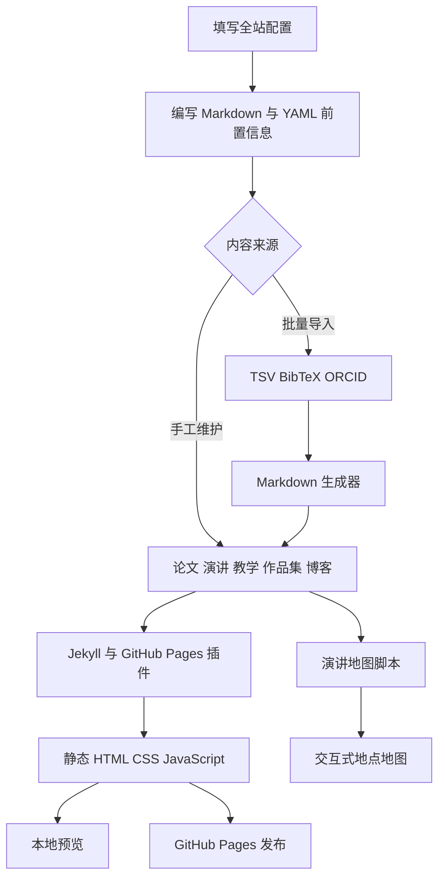
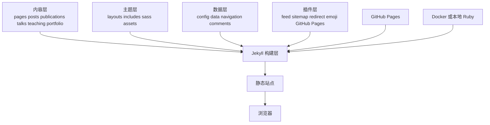

<div align="center">
  

  <sub>图 1.1　面向论文、演讲、教学、作品集、博客与履历的学术主页模板</sub>
</div>

<h1 align="center">Academic Portfolio</h1>

<p align="center">
  基于 Academic Pages 的数据驱动型 Jekyll 学术主页<br />
  内容与主题分离，可在 GitHub Pages 或本地容器中构建
</p>

<p align="center">
  <a href="./README.md"><strong>简体中文</strong></a> ·
  <a href="./README.en.md">English</a> ·
  <a href="./_pages/markdown.md">写作指南</a> ·
  <a href="./CONTRIBUTING.md">贡献指南</a> ·
  <a href="./LICENSE">许可证</a>
</p>

<p align="center">
  
  
  
  
  
  <br />
  <sub>技术栈依据依赖清单与容器基线 [1][2][3]</sub>
</p>

> [!IMPORTANT]
> 当前分支已经将姓名、学校、精确位置、账号标识、实际站点地址和真实头像替换为占位内容

发布个人主页前可以在本地填写真实资料，但提交公开仓库前应逐项确认公开范围

本文所有数值均取自当前仓库文件、本次本地构建记录或 GitHub 构建记录，引用编号见第 17 章

## 1 项目概览

Academic Portfolio 是 Academic Pages 的定制副本，它把论文、演讲、教学、项目、博客和履历保存为 Markdown、YAML、HTML 与附件，再由 Jekyll 构建静态网页 [1][4]

当前仓库同时包含主题实现、示例内容、页面模板、论文与幻灯片附件、批量内容生成器、演讲地图工具和 Docker 预览环境

示例标题与虚构履历用于说明结构，不代表已经核验的个人经历

<div align="center">

表 1.1　项目定位

| 维度 | 当前实现 | 适用判断 |
| --- | --- | --- |
| 网站类型 | 学术与技术作品集 | 适合研究者、学生、工程师和讲师 |
| 内容组织 | Markdown 与 YAML 前置信息 | 内容可复用，主题改动不会直接改写资料 |
| 构建方式 | Jekyll、GitHub Pages、Docker | 支持托管构建和本地预览 |
| 内容范围 | 论文、演讲、教学、作品集、博客、履历、地图 | 单一仓库覆盖常见学术展示场景 |
| 当前数据 | 上游示例内容与隐私占位资料 | 发布前需要替换并核验 |
| 许可证 | MIT [5] | 可以按许可证使用、修改和分发 |

</div>

## 2 页面预览

以下截图由当前脱敏源码在本地 Jekyll 环境真实构建，页面只含模板示例和保留隐私的占位资料

<div align="center">
  

图 2.1　首页展示导航、通用头像、作者占位资料和 Academic Pages 使用说明
</div>

<details>
<summary><strong>展开论文列表页面</strong></summary>

<br />

<div align="center">
  

图 2.2　论文列表由结构化前置信息生成，截图内容属于模板示例
</div>
</details>

<details>
<summary><strong>查看上游模板参考界面</strong></summary>

<br />

<div align="center">
  

图 2.3　仓库原有的 Academic Pages 模板参考截图
</div>
</details>

## 3 核心能力

<div align="center">

表 3.1　站点能力与内容来源

| 能力 | 用户可以展示什么 | 主要来源 |
| --- | --- | --- |
| 个人首页 | 简介、头像、所属机构、位置和联系入口 | `_config.yml`、`_pages/about.md` |
| 论文归档 | 分类、标题、摘要、期刊或会议、引用与附件 | `_publications/` |
| 演讲归档 | 日期、地点、活动、摘要、幻灯片与地图坐标 | `_talks/` |
| 教学归档 | 课程、学期、角色和课程说明 | `_teaching/` |
| 作品集 | 项目图文、外部链接与自定义 HTML | `_portfolio/` |
| 博客 | 按年、分类和标签组织的文章 | `_posts/` |
| 动态履历 | 自动汇总论文、演讲与教学条目 | `_pages/cv.md` |
| 演讲地图 | 根据演讲地点生成可交互地图 | `talkmap.py`、`talkmap.ipynb` |
| 批量生成 | 从 TSV、BibTeX 或 ORCID 数据生成 Markdown | `markdown_generator/` |
| SEO 与订阅 | 站点地图、Feed、重定向、分享元数据 | Jekyll 插件与主题包含文件 [1] |
| 评论与分析 | 可选 Disqus、Discourse、Facebook、Staticman 与分析服务 | `_config.yml`、`_includes/` |
| 容器预览 | 使用 Ruby 3.2 镜像构建并监听端口 `4000` | `Dockerfile` [3] |

</div>

## 4 内容生成流程

<div align="center">



图 4.1　内容、生成器、Jekyll 与发布目标之间的关系

</div>

Markdown 负责可读内容，YAML 前置信息负责日期、分类、链接和布局

相同的演讲数据可以同时出现在演讲列表、单篇页面、履历和地图中 [4]

## 5 系统结构

<div align="center">



图 5.1　内容、主题、配置、插件与构建环境

</div>

<div align="center">

表 5.1　主要组件

| 组件 | 职责 | 维护边界 |
| --- | --- | --- |
| Jekyll | 解析内容、布局和集合并生成静态文件 | Ruby 依赖由 `Gemfile` 管理 |
| Minimal Mistakes 衍生主题 | 导航、响应式布局、归档、作者侧栏与页面组件 | 样式位于 `_sass/`，模板位于 `_layouts/` 与 `_includes/` |
| GitHub Pages 插件集 | 提供托管兼容的 Jekyll、Feed、站点地图和元数据 | 版本由 `github-pages` 元包决定 [1] |
| JavaScript 构建 | 合并并压缩 jQuery 与界面插件 | 脚本位于 `package.json` [2] |
| 内容生成器 | 将表格、参考文献和 ORCID 数据转换为条目 | Python 与 Jupyter 文件位于 `markdown_generator/` |
| 演讲地图 | 地理编码地点并输出 Leaflet 地图 | 需要网络数据源和位置核验 |

</div>

## 6 快速开始

### 6.1 从模板创建站点

- 第一步，注册 GitHub 账号并完成邮箱确认

- 第二步，在 Academic Pages 上游仓库选择 `Use this template`，然后创建自己的仓库 [6]

- 第三步，将仓库命名为 GitHub Pages 认可的个人站点名称

公开文档和截图中使用 `account-name` 作为账号占位符

- 第四步，修改 `_config.yml` 和 `_data/navigation.yml`，再向各内容目录加入已经核验的资料 [7]

- 第五步，将论文、幻灯片或压缩包放入 `files/`，通过相对链接引用附件

- 第六步，在仓库设置的 Pages 页面检查构建来源和发布状态，README 中无需写入实际部署地址

- 第七步，可选运行 `markdown_generator/` 中的 Python 或 Jupyter 工具，批量生成论文与演讲条目

### 6.2 在 Linux 或 WSL 预览

```bash
  # 安装 Ruby 开发文件、Bundler、Node.js 和原生扩展编译工具
sudo apt install ruby-dev ruby-bundler nodejs build-essential gcc make # 安装 Jekyll 构建依赖

  # 安装 Gemfile 声明的 Ruby 依赖
bundle install # 首次运行会解析并安装 Jekyll 与插件

  # 在本机回环地址启动自动刷新预览
bundle exec jekyll serve -l -H localhost # 默认通过 localhost 的 4000 端口访问
```

若历史锁文件与当前 Ruby 环境冲突，可以先备份并移除 `Gemfile.lock`，再重新运行 `bundle install`

当前仓库没有提交锁文件，因此每次全新解析都可能获得不同的间接依赖版本

### 6.3 在 macOS 预览

```bash
  # 使用 Homebrew 安装 Ruby 和 Node.js
brew install ruby # 安装独立 Ruby 环境
brew install node # 安装 JavaScript 构建工具

  # 安装 Bundler 并解析项目依赖
gem install bundler # 安装 Ruby 依赖管理器
bundle install # 安装 Jekyll 与插件

  # 启动本地自动刷新预览
bundle exec jekyll serve -l -H localhost # 默认通过 localhost 的 4000 端口访问
```

## 7 使用 Docker

Dockerfile 以 Ruby `3.2` 为基础，安装 `build-essential` 与 Node.js，使用 Bundler `2.3.26` 安装依赖，并通过 Jekyll 监听容器内 `4000` 端口 [3]

### 7.1 类 Unix 系统

```bash
  # 构建本地 Jekyll 镜像
docker build -t academic-portfolio . # 使用仓库中的 Dockerfile

  # 挂载当前目录并开放预览端口
docker run -p 4000:4000 --rm -v "$(pwd):/usr/src/app" academic-portfolio # 退出后自动删除容器
```

### 7.2 Windows PowerShell

```powershell
  # 构建本地 Jekyll 镜像
docker build -t academic-portfolio . # 使用仓库中的 Dockerfile

  # 使用 PowerShell 当前目录变量完成卷映射
docker run -p 4000:4000 --rm -v "${PWD}:/usr/src/app" academic-portfolio # 将当前目录挂载到容器工作目录
```

### 7.3 Windows 命令提示符

Windows 命令提示符不能使用 PowerShell 的 `${PWD}` 变量，需要把卷映射左侧替换为经过核验的绝对路径，例如保留域形式的 `C:\path\to\site`

若卷映射失败，应在 Docker Desktop 的资源与文件共享设置中允许项目所在驱动器

不要把真实用户名、家庭目录或服务器路径写入公开问题、截图和 README

## 8 内容管理

<div align="center">

表 8.1　内容目录与前置信息

| 路径 | 一个文件代表什么 | 常用字段 |
| --- | --- | --- |
| `_pages/` | 固定页面与归档入口 | `title`、`permalink`、`layout` |
| `_posts/` | 一篇博客文章 | 日期、标题、分类、标签 |
| `_publications/` | 一篇论文或出版物 | `category`、`venue`、`paperurl`、`citation` |
| `_talks/` | 一场演讲或教程 | 日期、地点、活动、幻灯片链接 |
| `_teaching/` | 一段教学经历或课程 | 课程名、学期、角色、描述 |
| `_portfolio/` | 一个项目或作品 | 标题、摘要、图片、外部链接 |
| `files/` | 可下载附件 | PDF、幻灯片和其他公开资料 |
| `_data/navigation.yml` | 顶部导航 | 菜单标题与相对路径 |

</div>

编辑者可以使用本地 Git 客户端，也可以在 GitHub 文件页面使用铅笔按钮直接修改，使用删除按钮移除文件，并在目标目录创建或上传新文件

任何删除操作都应先确认附件和内部链接的引用关系

仓库内的 `_pages/markdown.md` 展示标题、表格、代码、高亮、通知、折叠内容和其他主题语法，适合作为写作时的本地参考 [8]

## 9 批量内容生成

`markdown_generator/` 同时保留 Python 脚本、Jupyter Notebook、TSV 示例、BibTeX 导入和 ORCID 转换工具

推荐工作流是先在表格中维护论文与演讲，再生成独立 Markdown 文件，人工核验后提交

<div align="center">

表 9.1　自动化工具

| 工具 | 输入 | 输出或用途 |
| --- | --- | --- |
| `publications.py` / `.ipynb` | `publications.tsv` | 生成论文条目 |
| `talks.py` / `.ipynb` | `talks.tsv` | 生成演讲条目 |
| `pubsFromBib.py` / `.ipynb` | BibTeX | 转换参考文献记录 |
| `OrcidToBib.ipynb` | ORCID 公开记录 | 生成 BibTeX 中间数据 |
| `talkmap.py` / `.ipynb` | `_talks/` 中的位置字段 | 生成演讲地点地图 |

</div>

地理编码会把地点发送给外部服务，运行前应删除家庭地址、精确办公位置和其他不必要的个人位置

## 10 配置隐私

`_config.yml` 控制语言、标题、站点描述、URL、作者侧栏、学术账号、社交账号、评论、分析、Feed、集合、默认布局和插件 [4]

<div align="center">

表 10.1　公开前的隐私检查

| 数据 | 当前仓库状态 | 发布建议 |
| --- | --- | --- |
| 姓名与代词 | 使用 `Portfolio Owner` 和空值 | 只填写愿意长期公开的版本 |
| 学校与单位 | 使用 `Affiliation withheld` | 可写机构名称，避免内部部门编号 |
| 地点 | 使用 `Location withheld` | 城市级信息通常足够，避免邮编和街道 |
| 邮箱 | 使用保留域 `example.invalid` | 使用公开联系邮箱，避免私人主邮箱 |
| GitHub 与社交账号 | 保持空值 | 逐项填写，不复制内部用户编号 |
| 站点地址 | 保持空值 | 需要规范网址时在部署配置中填写，README 不记录实际地址 |
| 头像 | 使用通用剪影 | 发布真人照片前检查 EXIF 与背景信息 |
| 分析与评论 | 默认关闭 | 启用前补充隐私说明与 Cookie 策略 |

</div>

提交前还应扫描访问令牌、API 密钥、私钥、密码、真实部署地址、账号编号、本机路径和附件元数据

图片与 PDF 需要单独检查，因为普通文本搜索无法覆盖二进制元数据

## 11 项目结构

<div align="center">

表 11.1　目录导航

| 路径 | 内容 |
| --- | --- |
| `_config.yml` | 全站设置、作者资料、集合、插件和构建参数 |
| `_data/` | 导航、界面文本、作者与示例评论数据 |
| `_pages/` | 首页、归档、履历、地图、指南和法律页面 |
| `_posts/` | 示例博客文章 |
| `_publications/` | 示例论文与引用信息 |
| `_talks/` | 示例演讲与教程 |
| `_teaching/` | 示例教学记录 |
| `_portfolio/` | Markdown 与 HTML 作品集示例 |
| `_layouts/`、`_includes/` | 页面骨架和可复用组件 |
| `_sass/`、`assets/` | 样式、字体图标、脚本和 README 资产 |
| `images/`、`files/` | 页面图片、论文与幻灯片 |
| `markdown_generator/` | 内容批量生成工具 |
| `talkmap/` | Leaflet 地图运行资产 |
| `Dockerfile`、`Gemfile` | 容器与 Ruby 构建环境 |

</div>

## 12 验证结果

本次验证在 Ubuntu、Ruby `3.2.3`、Bundler `2.3.26` 和 Node.js `22.15.0` 环境完成

由于 WSL 没有系统级 Ruby 开发包权限，验证过程在临时目录提取了与当前 Ruby 匹配的开发头文件，没有改写仓库构建定义

```bash
  # 安装仓库声明的 Ruby 依赖
bundle install # 解析 Gemfile 并安装 Jekyll 与插件

  # 生成完整静态站点并显示错误追踪
bundle exec jekyll build --trace # 输出到默认 _site 目录
```

<div align="center">

表 12.1　本次端到端验证

| 检查 | 结果 | 说明 |
| --- | --- | --- |
| Jekyll 完整构建 | 通过 | 静态站点生成完成，无构建错误 |
| 首页浏览器检查 | 通过 | 脱敏作者资料、导航和正文正常显示 |
| 论文页浏览器检查 | 通过 | 分类、条目、引用和附件入口正常显示 |
| 浏览器控制台 | 通过 | 使用本地 URL 覆盖后为 0 条错误 |
| README 本地资源 | 通过 | 主视觉与 3 张预览图均位于仓库 |
| 当前树身份扫描 | 通过 | 直接身份字符串只存在于历史提交，不在当前文件树 |
| GitHub Pages 历史构建 | 通过 | `master` 分支已有成功构建记录，实际地址未写入 README |
| Windows 原生检出 | 失败 | 现有异常目录名含尾随空格，Git for Windows 拒绝检出 |

</div>

## 13 已知限制

- 仓库包含一个异常路径，工作流文件位于名称带尾随空格的目录中

GitHub 不会把它识别为标准 `.github/workflows/` 工作流，Git for Windows 也无法检出该路径
- 当前异常工作流仍使用 `actions/checkout@v2`、`actions/setup-python@v2` 和 Python `3.9`，即使后续迁移到标准目录，也应先升级和审核其自动提交行为
- 当前没有提交 `Gemfile.lock`，全新环境会重新解析间接依赖，长期可复现性有限
- `github-pages` 元包约束 Jekyll `3.10`，本地直接安装最新版 Jekyll 可能与托管环境不同
- 示例论文、演讲、教学、履历和博客用于展示模板能力，发布者必须逐条替换或删除
- 演讲地图依赖外部地理编码与 Leaflet 资源，地点解析结果可能不准确
- 评论、分析和社交集成默认需要额外账号、隐私声明与网络验证
- 主题源自较早的 Minimal Mistakes 分支，直接同步上游可能产生大量冲突
- 真实头像已经从当前树删除，但 Git 历史仍保留旧对象

若历史公开本身构成风险，需要单独评估历史重写及其协作影响

## 14 上游维护

Academic Pages 的模板缺陷和功能请求应提交到上游 Issue，样式与使用问题可以进入上游 Discussions [6]

若计划向上游贡献修复，应先 fork 上游仓库，而不是只通过 `Use this template` 创建无共同历史的副本

保留共同历史后才能使用 GitHub 的 fork 同步流程

模板副本一旦修改配置、内容和主题，同步上游通常会产生冲突

原 README 提供了两种恢复方式：保存自己的 YAML、Markdown 与附件后重新 fork，或人工挑选并移植上游补丁

当前仓库还包含异常 Windows 路径，执行任何同步前应先在 Linux 环境建立可恢复分支

## 15 贡献指南

- 第一步，创建 Issue，说明运行系统、Ruby 版本、复现步骤、期望结果和实际结果，日志与截图必须先脱敏

- 第二步，从 `master` 创建短分支，保持内容、主题、构建或文档改动范围清晰

- 第三步，运行 Jekyll 完整构建，检查首页、受影响页面、内部链接、附件和浏览器控制台

- 第四步，检查姓名、邮箱、账号编号、站点地址、本机路径、令牌、私钥、图片 EXIF 和 PDF 元数据

- 第五步，提交 Pull Request，写明兼容性、隐私影响、验证环境和回滚方法

仓库已有的 [`CONTRIBUTING.md`](./CONTRIBUTING.md) 保留上游协作规则，提交前应同时阅读

## 16 许可来源

本项目依照 MIT 许可证发布 [5]

Academic Pages 由 Stuart Geiger 从 Michael Rose 创建的 Minimal Mistakes Jekyll Theme 分离并扩展，后来由 Robert Zupko 等维护者持续维护 [6][9]

使用本仓库时应保留许可证和上游署名

下列内容附件可能拥有独立权利：

- 论文和履历
- 图片和演讲材料
- 其他内容附件

替换示例内容时需要确认各自授权

## 17 参考资料

[1] “Gemfile,” 本仓库 Ruby 与 Jekyll 依赖清单，[`Gemfile`](./Gemfile)

[2] “package.json,” 本仓库 JavaScript 依赖与构建脚本，[`package.json`](./package.json)

[3] “Dockerfile,” 本仓库 Ruby 3.2 容器构建定义，[`Dockerfile`](./Dockerfile)

[4] “_config.yml,” 本仓库站点、作者、集合与插件配置，[`_config.yml`](./_config.yml)

[5] “MIT License,” 本仓库许可证，[`LICENSE`](./LICENSE)

[6] Academic Pages Maintainers, “Academic Pages,” GitHub, [https://github.com/academicpages/academicpages.github.io](https://github.com/academicpages/academicpages.github.io)

[7] “navigation.yml,” 本仓库顶部导航定义，[`_data/navigation.yml`](./_data/navigation.yml)

[8] “Markdown Guide,” 本仓库 Academic Pages 写作示例，[`_pages/markdown.md`](./_pages/markdown.md)

[9] M. Rose, “Minimal Mistakes Jekyll Theme,” [https://mmistakes.github.io/minimal-mistakes/](https://mmistakes.github.io/minimal-mistakes/)
